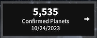
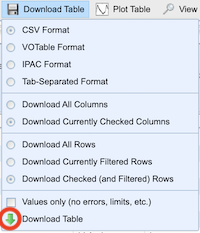

# Les sujets

Le 1er sujet, sur les pentominos, utilise `numpy` et est un sujet plutôt bien défini.

Les autres sujets, utilisent `pandas`, et sont des sujets plus ouverts pour lesquels vous proposerez des analyses exploratoires des données (une petite section en annexe, vous donne quelques pistes) en utilisant `pandas`, `numpy` et des librairies de visualisation.

## sujet `numpy`

### sujet #1: les pentominos

Vous utiliserez un algorithme de backtracking (disponible dans une librairie) pour
résoudre des problèmes de puzzle; tous les détails sont ici:

<https://flotpython-exos-ds.readthedocs.io/en/main/numpy-tps/pentominos/README-pentominos-nb.html>

## des données sur la société

### sujet #2: l'indice du bonheur

Les indicateurs économiques (PNB) ne tiennent pas suffisamment compte du bonheur des individus, proposez des idées pour pallier à ce problème; un peu plus de détails dans le fichier séparé [`sujet-happiness.md`](./sujet-happiness.md)

## des données liées à l'énergie

### sujet #3: l'électricité dans le monde

Le fichier `data/world-country-electricity.csv` contient des valeurs annuelles, de 1980 à 2021, de production, consommation, importation, exportation, capacité installées, pertes ... liées à électricité dans le monde. *Les capacités sont en millions de `kW`, les autres valeurs sont en milliards de `kWh`*  
Sources: World Bank, Statista, U.S Energy Administration...

## des données à caractère scientifique

### sujet #4: les exoplanètes

* le point d'entrée  
  <https://exoplanetarchive.ipac.caltech.edu/index.html>

* de là vous pouvez télécharger les données qui décrivent toutes les exoplanètes
  connues; par exemple cliquer sur  
  ,

  puis dans le menu *Download Table* vous pourrez choisir plusieurs options avant de cliquer, toujours dans le même menu, sur *Download Table*  
  

* vous y trouverez également quelques exemples de statistiques calculées sur les exoplanètes  
  <https://exoplanetarchive.ipac.caltech.edu/exoplanetplots/>  
  <https://exoplanetarchive.ipac.caltech.edu/docs/counts_detail.html>  

## des données à caractère géographique

### sujet #5: les tremblements de terre

* les données brutes  
  <https://public.opendatasoft.com/explore/dataset/significant-earthquake-database/export/>  
  (données GeoJSON à charger avec `geopandas`)

* le mode d'emploi des données  
  <https://public.opendatasoft.com/explore/dataset/significant-earthquake-database/information/>

* des exemples d'utilisation de ces données  
  <https://public.opendatasoft.com/explore/dataset/significant-earthquake-database/map/>

## des données à caractère financier

### sujet #6: les cours de bourse

en allant sur le site du NASDAQ:  
<https://www.nasdaq.com/market-activity/quotes/historical>  
vous pouvez télécharger les cours de bourse  
des grandes compagnies américaines sur plusieurs années

par exemple pour Apple:  
<https://www.nasdaq.com/market-activity/stocks/aapl/historical>  

si intérêt, on peut trouver des données relatives à l'inflation sur le site de l'OCDE  
<https://data.oecd.org/price/inflation-cpi.htm>

## quelques liens potentiellement utiles

enfin voici quelques liens vers des technologies qui pourraient vous être utiles

* pour faire rapidement un *dashboard* avec des visualisations interactives, vous pouvez regarder
  * `streamlit`,
    [voir une petite intro ici](https://flotpython-exos-ds.readthedocs.io/en/main/dashboards/streamlit/README-streamlit-nb.html)
  * `marimo`, [voir rapide intro](https://flotpython-exos-ds.readthedocs.io/en/main/dashboards/marimo/README-marimo-nb.html)
  * ou encore `dash` de Plotly, [voir une intro ici](https://flotpython-exos-ds.readthedocs.io/en/main/dashboards/dash/README-dash-nb.html)
* pour charger des données à caractère géographique, la bonne approche consiste à utiliser `geopandas`;
* et pour montrer facilement des objets géographiques (points ou zones) sur une carte,  
  vous pouvez utiliser `folium` en conjonction avec `geopandas`,  
  [voir un petit exemple ici](https://flotpython-exos-ds.readthedocs.io/en/main/geo-howtos/folium/HOWTO-folium-nb.html)
* enfin [on vous rappelle l'URL des cours: `https://ue12-p24-numerique.readthedocs.io/`](https://ue12-p23-numerique.readthedocs.io/)

## ANNEXE Analyse exploratoire des données

L'analyse exploratoire de données cherche à comprendre les données, à les préparer en vu de futurs traitements. Dans cette phase initiale, vous visualisez les données, vous y faites les premières observations, statistiques et analyses avant de recourir à des techniques plus sophistiquées de machine-learning qui chercheront souvent à *vérifier* les intuitions acquises dans la phase d'exploration des données.

Voici, à titre indicatif, quelques premières idées simples d'analyses *génériques* à mener lorsque vous commencez à travailler sur un dataset. Naturellement vous devez adapter votre démarche à votre cas particulier, sans oublier d'avoir recours à votre bon sens pour mettre en oeuvre des analyses spécifiques.

- que pouvez vous dire de la taille du dataset
- vérifier la cohérence entre les types des colonnes et leur contenu
- faites un bilan des valeurs manquantes
- regardez les statistiques descriptives de vos colonnes  
voyez-vous des tendances particulières ? (outliers, asymétries...) ?
 - tracez vos données (plot, boxplot, scatter...)
- regardez les colonnes contenant des catégories (distribution...)
- si vous avez des dates, le regroupement des données par période (semaine, weekend, saison, mois, année) vous apporte-il des informations intéressantes ?
- pensez-vous qu'il manque des informations dans ce dataset ?
- certaines de vos colonnes sont-elles corrélées ? (relplot)
- ...